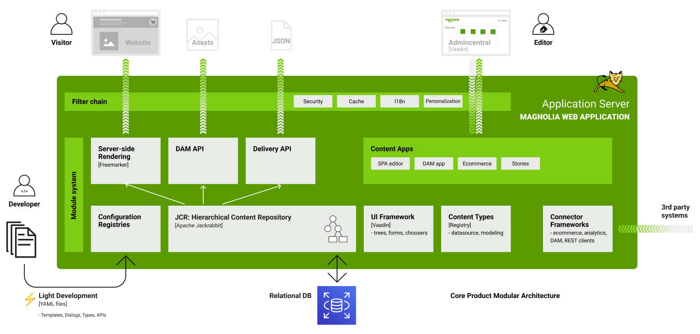

# Magnolia CMS

Reference: [Magnolia Getting Started](https://docs.magnolia-cms.com/product-docs/getting-started-with-magnolia/)

> Get [SDKMAN!](https://sdkman.io/install/) to install Java and [Magnolia CLI](https://docs.magnolia-cms.com/magnolia-cli/) for further works.

mgnl create-component quotation -a pages/hello@main -lm hello-magnolia

## 1. Architecture and Operation Models

Reference: [Magnolia Architecture](https://docs.magnolia-cms.com/product-docs/administration/architecture/)

- **Magnolia CMS**:
- **Magnolia Nexus**:
- **Light Modules**:
- **SPA**:
- **JCR** (Java Content Repository): Apache Jackrabbit is a fully conforming implementation of the JCR API.
- **DAM**:

## 2. Headless CMS

## 3. Multicluster Environments

## 4.